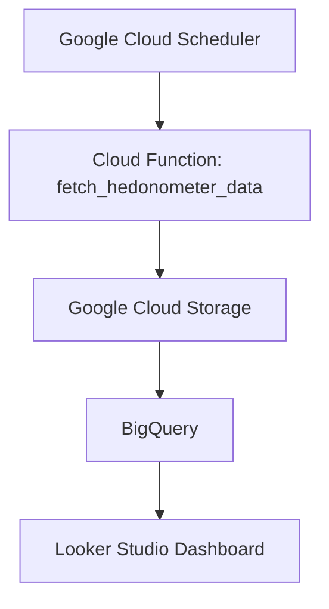

# 🌍 Análisis de la Felicidad Mundial con Big Data y Google Cloud

Este proyecto analiza y compara la percepción de felicidad global utilizando dos fuentes principales:

- **World Happiness Report 2023** – Perspectiva socioeconómica basada en encuestas y métricas como PIB per cápita, apoyo social, esperanza de vida, etc.
- **Hedonometer** – Perspectiva emocional basada en el análisis de sentimientos de publicaciones en redes sociales en tiempo real.

El flujo de recolección, almacenamiento, procesamiento y visualización de datos se automatiza utilizando herramientas de **Google Cloud Platform (GCP)**. Los resultados se presentan en un dashboard interactivo desarrollado con **Looker Studio**.

---

## 🌟 Objetivo

Desarrollar un pipeline de datos completamente automatizado que permita:

- Obtener datos emocionales en tiempo real desde el Hedonometer.
- Integrarlos con datos estructurados del World Happiness Report.
- Procesarlos y analizarlos con BigQuery.
- Visualizarlos de forma clara en un dashboard interactivo.

---

## 🛠️ Tecnologías Usadas

| Herramienta               | Función Principal |
|---------------------------|------------------|
| Google Cloud Storage      | Almacenamiento de datos JSON/CSV |
| Google Cloud Functions    | Recolección de datos desde la API del Hedonometer |
| Google Cloud Scheduler    | Automatización semanal del ETL |
| BigQuery                  | Análisis y consultas SQL |
| Looker Studio             | Visualización de insights |
| Google Dataflow           | Se evaluó como opción para limpieza, pero se descartó por simplicidad |

---

## ⚙️ Arquitectura del Proyecto



---

## 📊 Visualizaciones del Dashboard

Visualizaciones desarrolladas en Looker Studio a partir de datos analizados en BigQuery:

- 📉 Comparación de felicidad promedio: WHR vs. Hedonometer  
- 🗺️ Mapa geográfico de la felicidad por país  
- 📈 Correlación entre PIB per cápita y nivel de felicidad  
- 🕖️ Frecuencia de menciones de felicidad en redes sociales (2008–2020)  
- 🇲🇽 Análisis de factores de felicidad en México  
- ↺ Evolución temporal de felicidad según ambas fuentes

🔗 **Dashboard en línea (activo):**  
[👉 Ver en Looker Studio](https://lookerstudio.google.com/reporting/5d131ad4-213d-45ee-98ab-b6ad5e688c63)

🖼️ **Vista previa del dashboard:**


---

## 🔄 Flujo de Datos

1. **Cloud Function (`main.py`)** obtiene datos JSON de la API de Hedonometer.
2. Se guarda automáticamente en **Google Cloud Storage**.
3. **Cloud Scheduler** ejecuta esta función cada semana (miércoles 7 PM EST).
4. Los datos se cargan en **BigQuery**, junto con el dataset del World Happiness Report.
5. En **Looker Studio**, se combinan las tablas y se visualizan los insights.

---

## 🥮 Código Principal – Cloud Function

```python
import functions_framework
import requests
from google.cloud import storage
import datetime
import json

@functions_framework.http
def fetch_hedonometer_data(request):
    url = "https://hedonometer.org/api/v1/happiness/?format=json"
    response = requests.get(url)
    data = response.json()
    data_string = json.dumps(data)

    storage_client = storage.Client()
    bucket = storage_client.bucket('gshbigdata-bucket')
    blob = bucket.blob(f'hedonometer_data_{datetime.datetime.now().strftime("%Y-%m-%d")}.json')
    blob.upload_from_string(data_string, content_type='application/json')
    
    return 'Data fetched successfully'
```

---

## 📄 Referencias

- [World Happiness Report 2023 – Kaggle](https://www.kaggle.com/datasets/ajaypalsinghlo/world-happiness-report-2023)  
- [Hedonometer API](https://hedonometer.org/)  
- [Google Cloud Functions](https://cloud.google.com/functions)  
- [BigQuery](https://cloud.google.com/bigquery)  
- [Looker Studio](https://lookerstudio.google.com/)

---

🚀 Proyecto desarrollado por **Gabriela Shaooli Cassab**  
